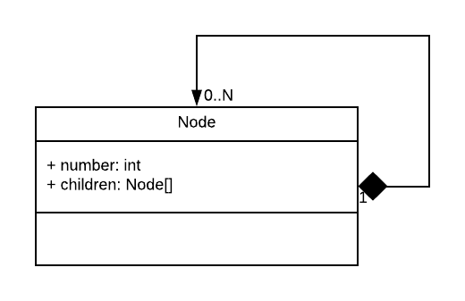

# Family Tree

El presente código contiene una representación de un árbol de números. Un árbol es una estructura que consiste de nodos conectados. Cada nodo contiene un dato (número) y una lista de nodos hijos, como muestra el siguiente diagrama:



Un nodo que no tiene hijos diremos que es una "hoja".

Por ejemplo, puedo utilizar un árbol para representar la siguiente estructura de números enteros:

```
    1
   / \
  2   3
```

## Visitor

El patrón visitor es un excelente aliado cuando necesitamos recorrer estructuras y realizar operaciones sobre ellas. Por ejemplo, puedo utilizar un Visitador para recorrer el árbol del ejemplo anterior y calcular la suma de sus nodos, cuyo resultado es 6.

## Parte 1: Crear un nodo Persona

Como primer objetivo, deberán modificar el programa provisto para que un Nodo almacene:

 - un objeto de tipo `Persona` (que deberán crear ustedes) con nombre y edad.
 - la lista de nodos hijos.

## Parte 2: Árbol genealógico

Crear en el `Program.cs` una estuctura de árbol de Personas para representar un árbol genealógico. Incluyan al menos 8 personas.

## Parte 3: Visitador

Para esta segunda parte deberán aplicar el patrón Visitor, implementando un visitador para calcular la suma de las edades de todos los integrantes de la familia.

## Parte 4: ¿Abierto a la extensión?

Para esta última parte, deberán crear 2 nuevos visitadores:

1️⃣ El primero vistará el árbol genealógico para determinar qué hijo es más grande (hijo = nodos hojas)

2️⃣ El segundo visitará el árbol genealógico y determinará quién tiene el nombre más largo.

